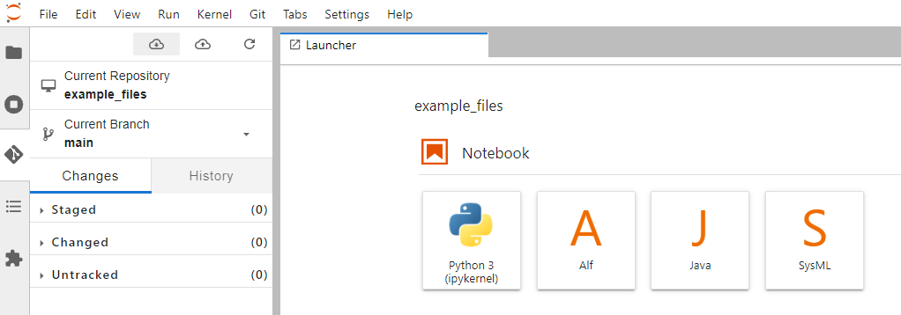

# jupyter_javas
Jupyter lab java build including IAlf, iJava, and the Jupyter SysMLv2 kernel for testing purposes.

Docker Image: 'avianinc\jupyter_javas:main` 

## Usage

1. Install Docker Desktop --> https://www.docker.com/products/docker-desktop (Requires admin privileges)
2. From the command line pull the docker file --> `docker pull avianinc/jupyter_javas:main` (get a beer... it takes a bit)
    

3. In docker desktop select the image and press 'Run`. 

    

4. Name the container (optional) and set the port to `8888` then press `Run`.

    

5. `Containers/Apps` will pop up showing the container icon green for the new container

    

6. Select the running container and press the `Open In Browser` icon

    

7. Jupyter lab will open... Ensure that the latest example files are pulled in jupyter lab

    

    - Press the git icon on the left toolbar... 

    - Drill down into the `example_files` folder

    - Press the down arrow to pull the latest files... 

---
### Docker File
The `Dockerfile` builds the image and when modified and pushed to github a workflow will kick off to republish the docker container to docker hub as `avianinc\jupyter_javas:main`

#### *Github files* - Use git hub files instead of a local volume to make life easier. Jupyter-git is installed.
#### *Jupyter-git* -  You must use a PAT (personal access token) to push files to your repo.
    - https://docs.github.com/en/authentication/keeping-your-account-and-data-secure/creating-a-personal-access-token 

### Docker Command Line 
- Build: `docker build -t jl_ijava .`  # dont for get the `.` after jl_java
- Run: `docker run -p 8888:8888 -it jl_ijava jl_java`
